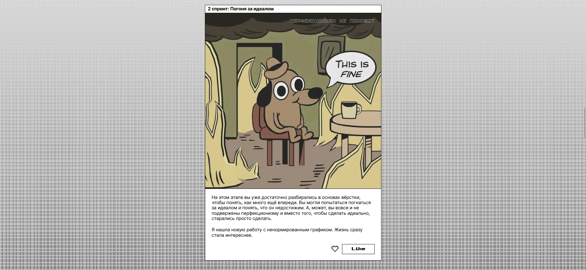
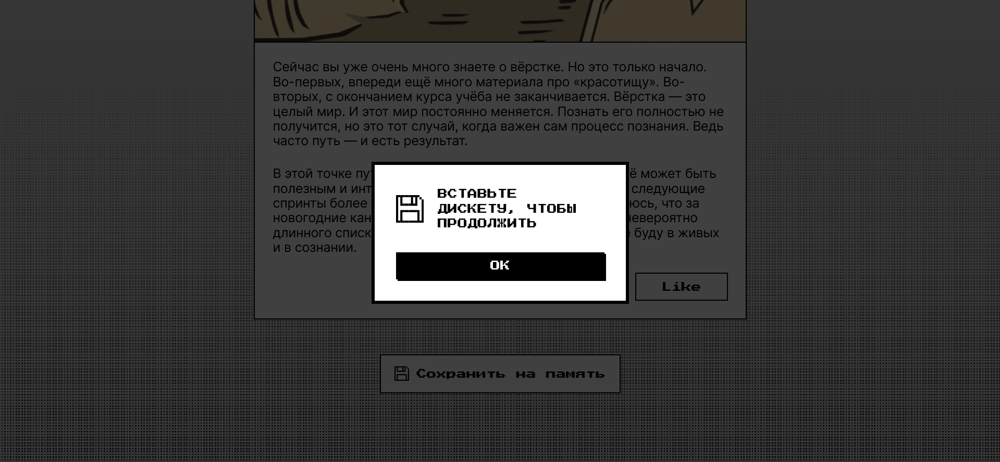
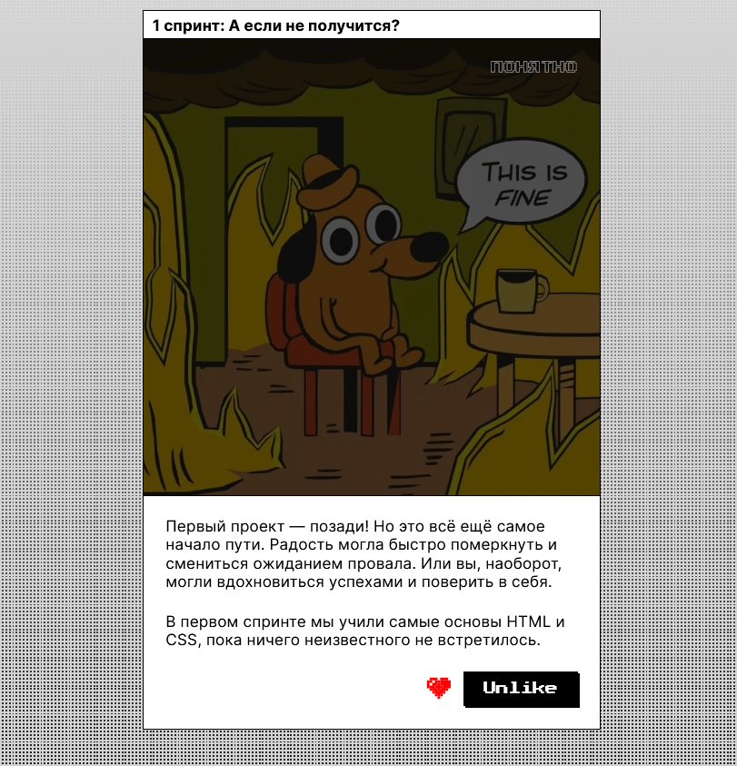

## Closing Tag - responsive decorative landing page
**Description:** Fourth study project in my Frontend Developer course at Yandex.Practicum.  
Sprint 4 – "Styling: decoration, approaches, and tools."  
[Demo availible](https://nanferro.github.io/zakrivayuschiy-teg-f/) in Russian.

🔧 Stack: HTML5, CSS3, vanilla JavaScript  
🛠️ Tools: Figma, VS Code, Git, GitHub

**Skills:**
- responsive layout via **desktop-first** approach
- working with SVG files (inline and external)
- CSS transitions and basic animations, improved image styling

## Screenshots  
  
  
  
